# TickTicket
 
## Deksripsi
TickTicket adalah sebuah Sistem atau Project Pemesanan Akomodasi secara Online seperti Tiket Pesawat, Tiket Kereta Api dan Pemesanan Hotel yang menggunakan konsep PHP-Native sebagai kerangka utamanya, Project ini mulai dibuat pada tanggal 21 Agustus 2021 dan setidaknya bisa saya rampungkan sebesar 85% selama kurang lebih 1 Minggu (tidak teratur).

<br>

## Instalasi
1. Clone atau Download repository ini.
2. Ekstrak dan pindahkan semua file ke dalam htdocc Xampp anda.
3. Import file ***tickticket.sql*** kedalam database Xampp anda.
4. Buka file ***admin/core/config.php***, jika diperlukan edit pada bagian untuk configurasi database.
    ```
    define('DB_HOST', 'localhost');
    define('DB_USER', 'root');
    define('DB_PASS', '');
    define('DB_NAME', 'tickticket');
    ```
5. Selesai.

<br>

## Hak Akses
1. Users (UniqCode 102)
2. Admin (UniqCode 105)
3. ~~Penyedia Akomodasi~~

<br>


## Fitur 
**Users:**
1. Login.
2. Registrasi.
3. Remember Me.
3. Aktifasi akun
4. Profil
5. Form Pemesanan Tiket(Pesawat&Kereta) dan Pencarian yang sudah support AJAX.
6. Opsi pemesanan Tiket(Pesawat&Kereta) Pulang-Pergi.
7. Form Pilih Tiket(Pesawat&Kereta). 
8. Form Pemesanan Hotel dan Pencarian yang sudah support AJAX.
9. Rekomendasi Kota Pemesanan Hotel.
10. Detail Kamar (foto dan fasilitas).
11. Pilih Kamar.
12. Checkout dan Form biodata diri
13. Histori dan Histori Transaksi
14. Cetak Transaksi.
15. Logout

**Admin:**
1. Login
2. Management User (Hapus | Banned)
3. Management Admin (Hapus | Banned)
4. ~~Management Transaksi~~
5. Konfirmasi Tindakan point 2 dan 3 dengan PIN
6. Profil
7. Logout

<br>

**~~Penyedia Akomodasi~~:**
1. ~~?~~

<br>

## Support by
1. [Bootstrap](https://getbootstrap.com/docs/4.5/)
2. [Fontawesome](https://fontawesome.com/)
3. [Picqer](https://github.com/picqer)


<br>

## Galeri
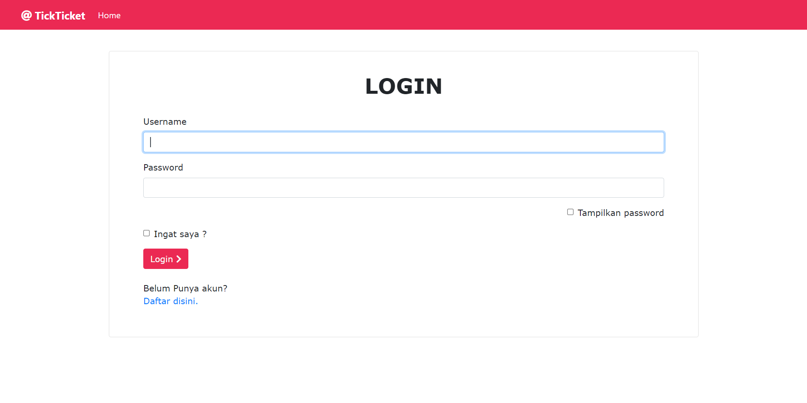</img> 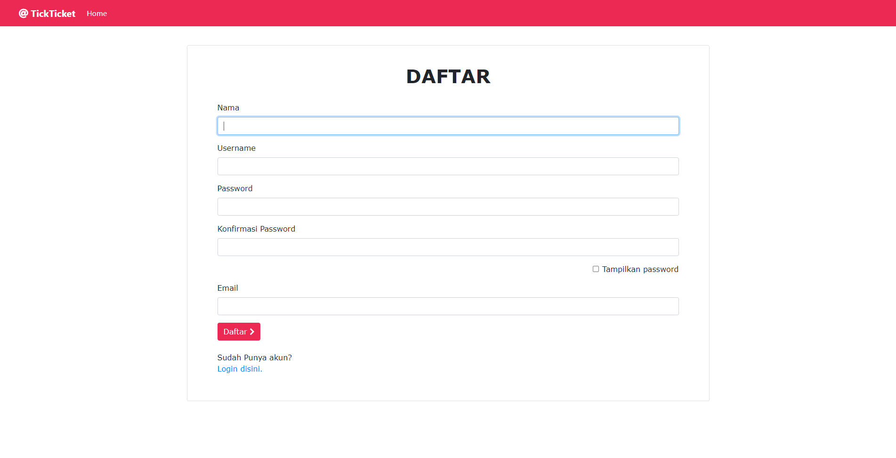</img>
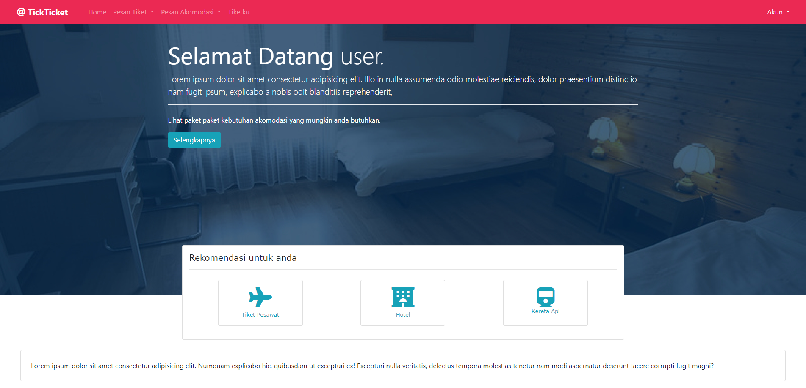</img> 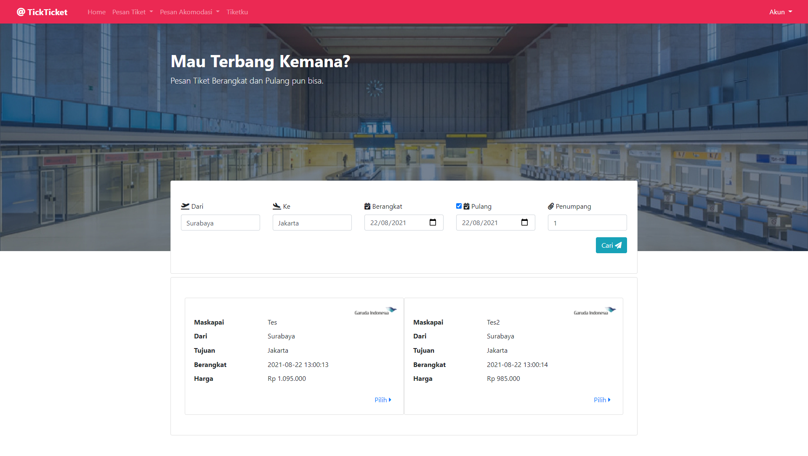</img>
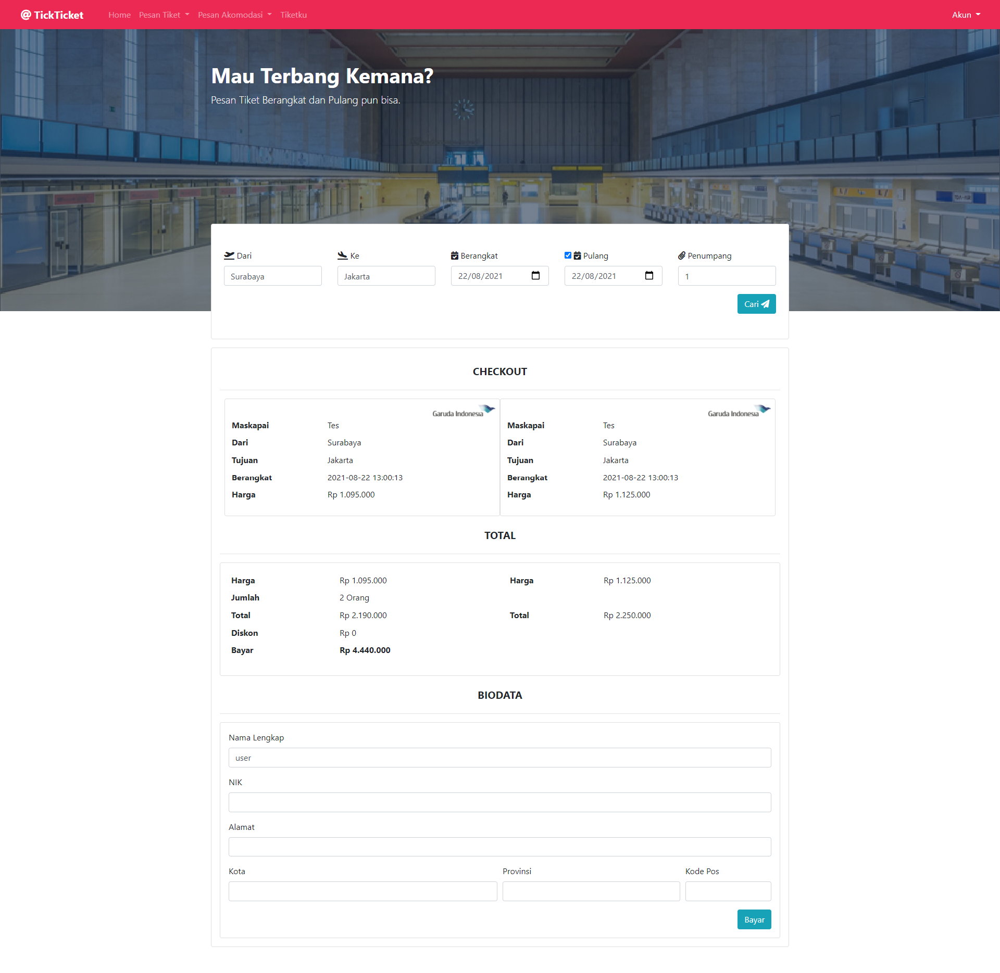</img> 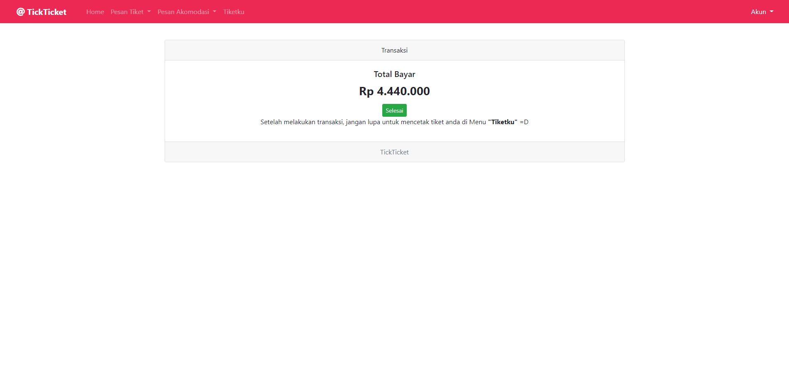</img>
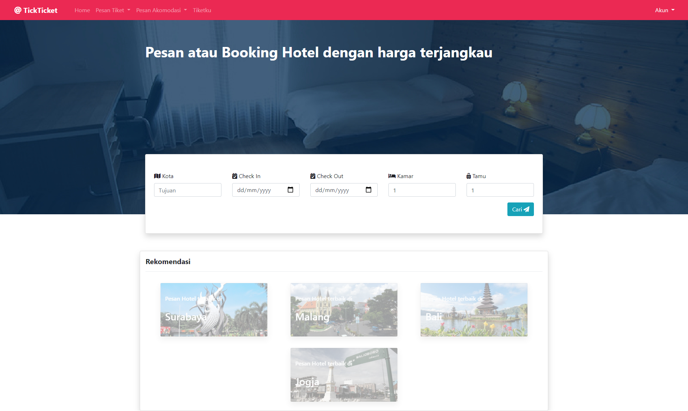</img> 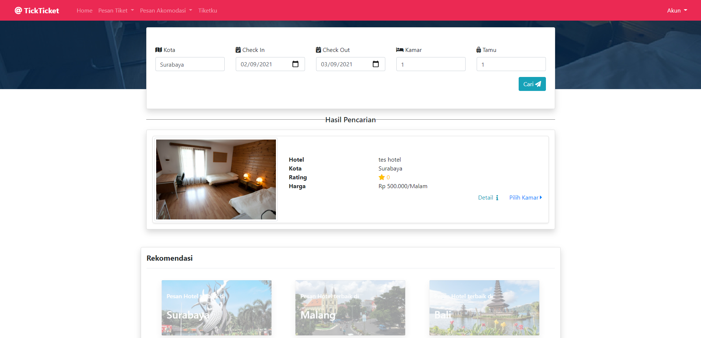</img>
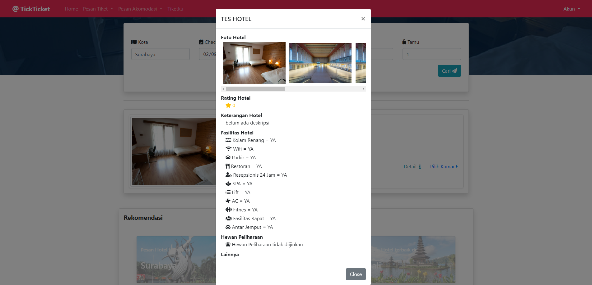</img> 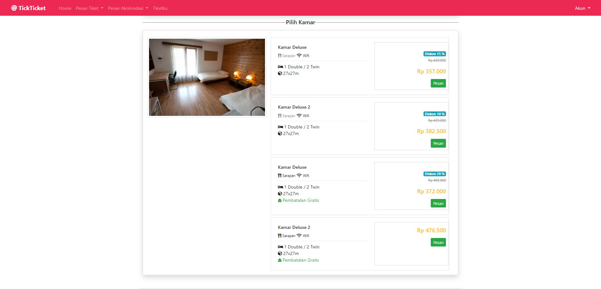</img>
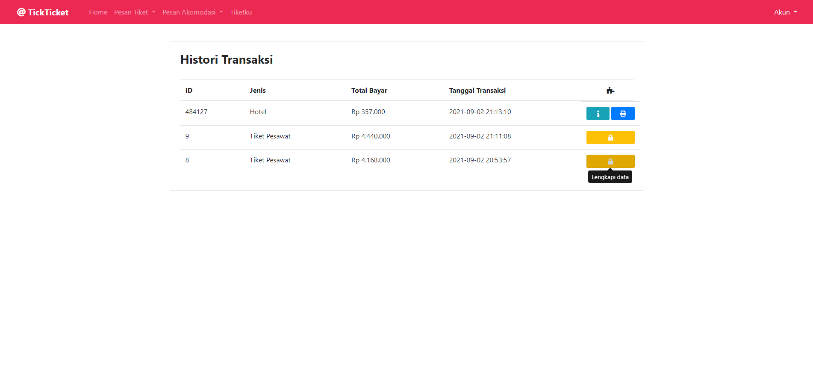</img> 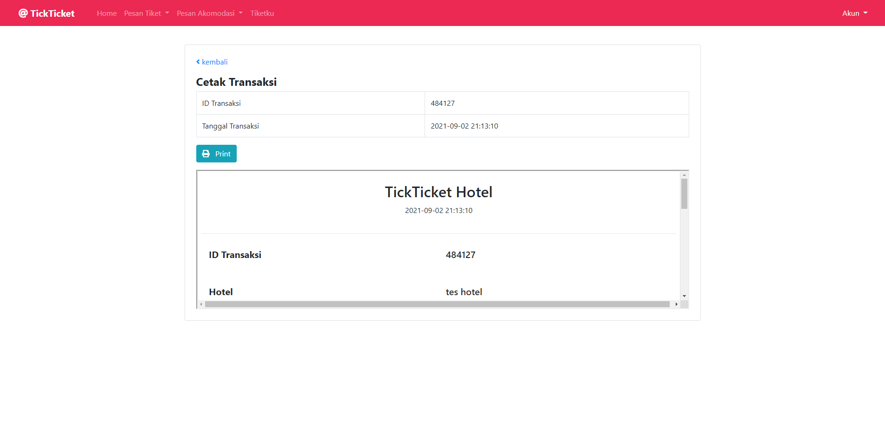</img>
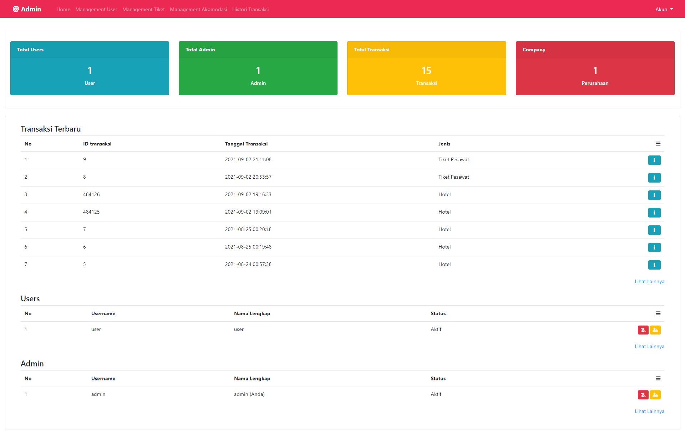</img> 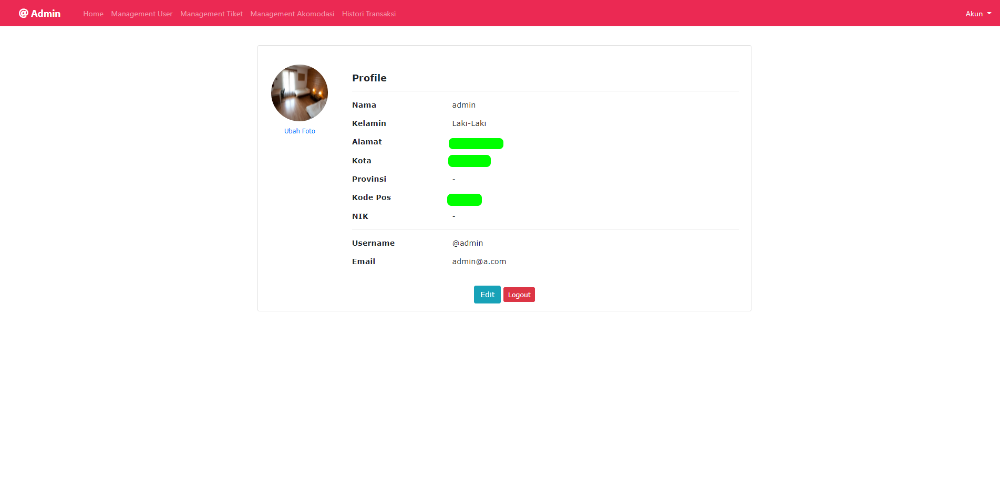</img>
